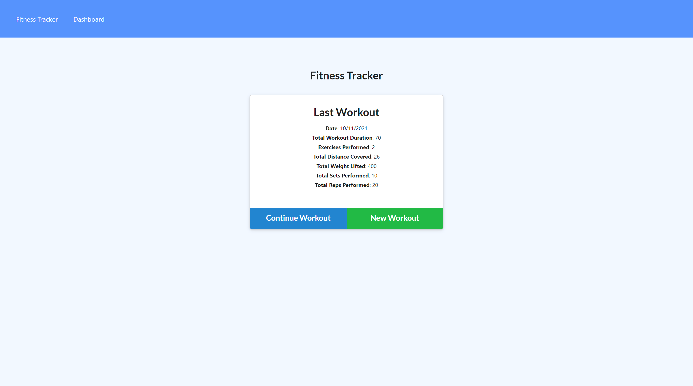
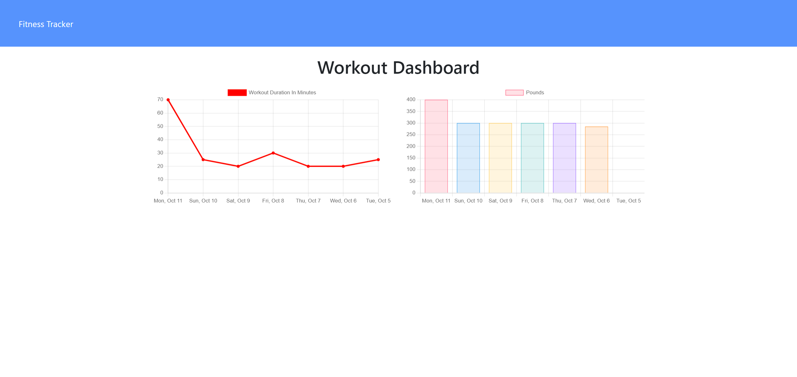
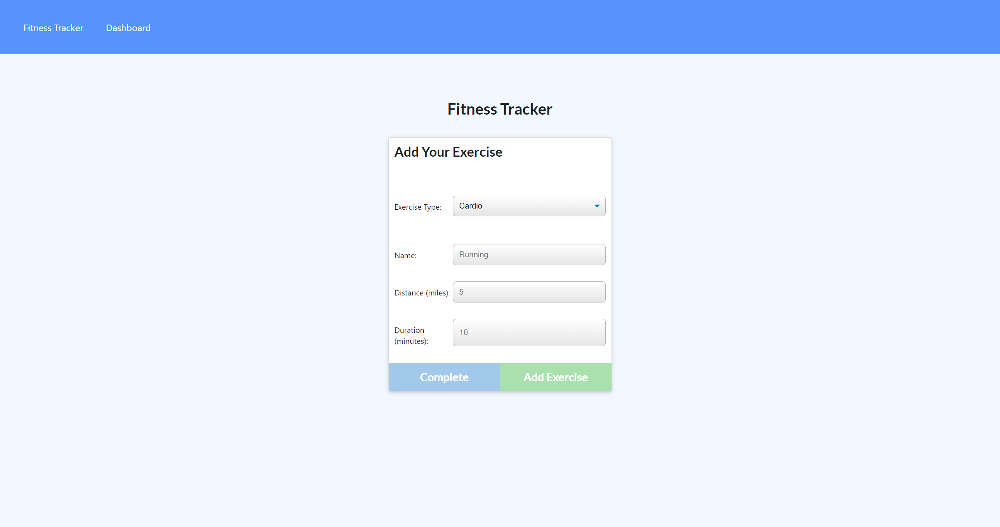
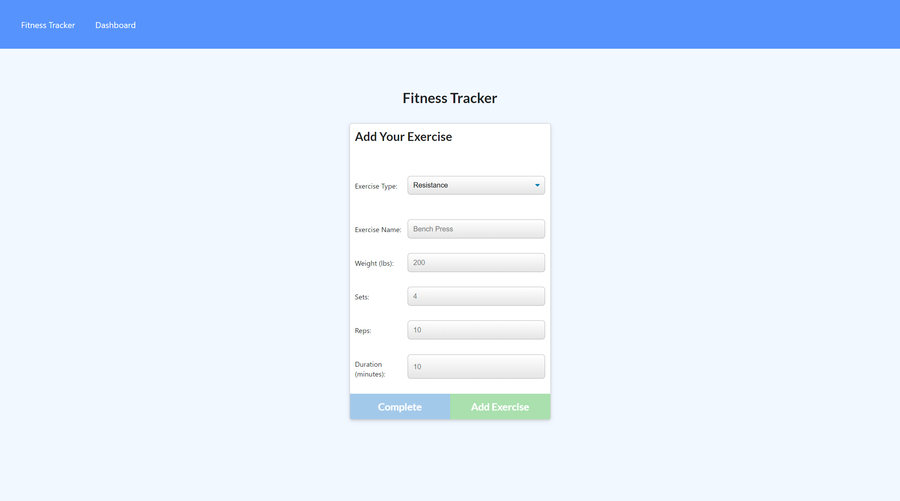

# Fitness Tracker - MongoDB, Mongoose, Node.js, Express.js

A fitness tracker that allows for the creation of workouts and multiple associated exercises for them. Users can continue existing workouts and add exercises to them as well. This project is hosted using [Heroku](https://heroku.com/) and [MongoDB Atlas](https://www.mongodb.com/cloud/atlas).

[A live demo can be found here.](https://desolate-oasis-16495.herokuapp.com/)

This project uses the following technologies/libraries.

-   [Node.js](https://nodejs.org/en/) and [Express.js](https://expressjs.com/) as the Server for API and HTTP Requests
-   [MongoDB](https://www.mongodb.com/) as a NoSQL Database
-   [Mongoose](https://mongoosejs.com/) for [Object Relational Mapping](https://en.wikipedia.org/wiki/Object%E2%80%93relational_mapping), Database Interaction, [Routing](https://expressjs.com/en/guide/routing.html) and Collection Generation and Seeding

## Installation

After cloning the repo to your system, run `npm i` at the project root to get the node project dependencies and then update the file `.env.EXAMPLE` to `.env`. MongoDB mist be installed on your system for local development. You can change the database name if desired. Then run `npm run seed` to populate the mongoDB with a collection of workout/exercise documents. Once this is complete use command `npm run dev` if you would like the server to use Nodemon and auto-restart when there are updates to code or `npm run start` for a normal server start. The application will be available by default at http://localhost:3001/ if you are using a local development environment.

## Screenshots

### Homepage

### Dashboard

## Add Cardio Exercise to Workout

## Add Resistance Exercise to Workout

